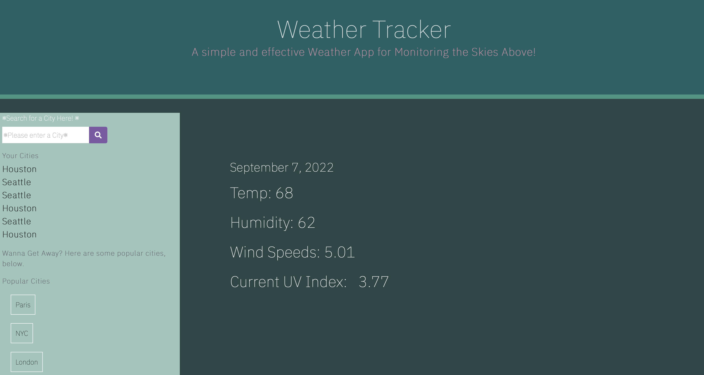
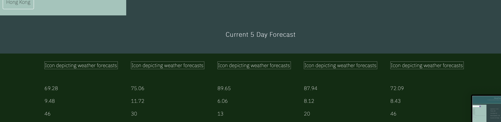
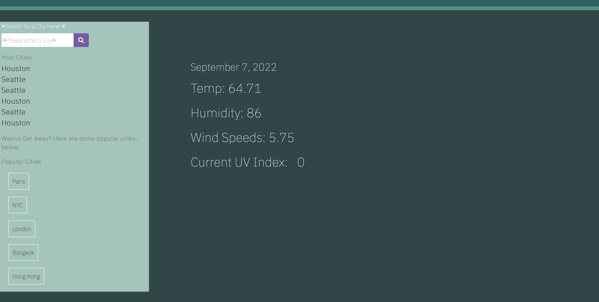
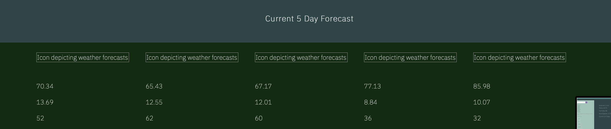
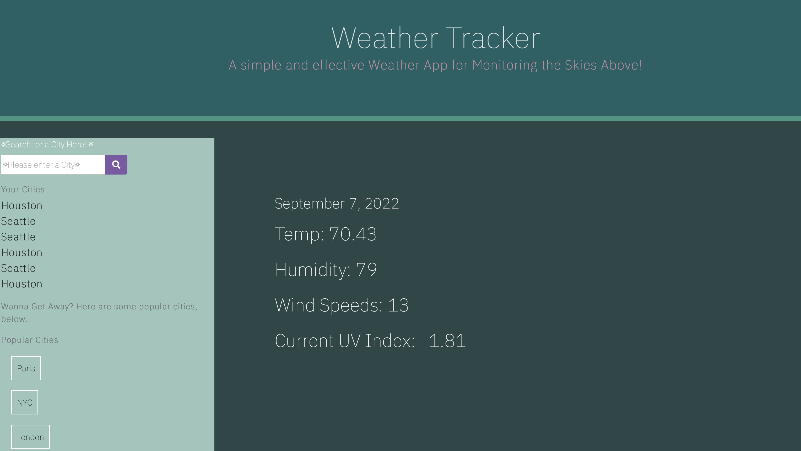
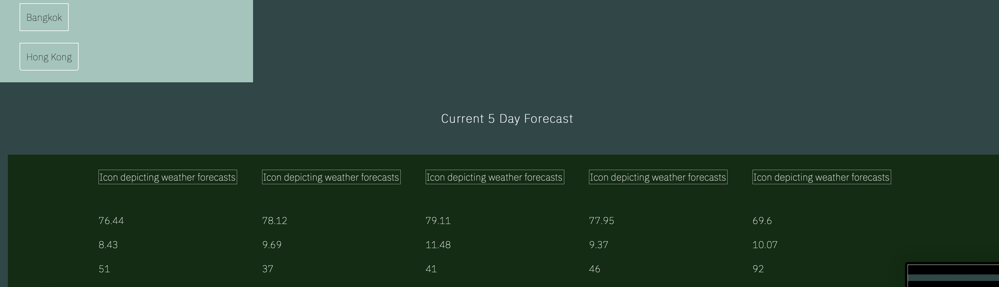

## cloudy-with-a-chance-of-meatballs

## Table of Contents 
 1. [Screenshots](#screenshots)
 2. [Description](#description)
 3. [User Story](#user-story)
 4. [Installation](#installation)
 5. [Utilized With](#utilized-with)
 6. [license](#license)

 
 ## screenshots
 - 
 - 
 - 
 - 
 - 
 - 

 
 ## description 
This is a weather tracker, utilized by Open Weather API. With this app, the user can track the five day forecast, and currernt forecast. They can also look humidity, uxIndex, & wind speeds.

 ## user story
AS A traveler
I WANT to see the weather outlook for multiple cities
SO THAT I can plan a trip accordingly

## installation
Pull up in local browser 

OR

use deployed link: https://yond3r.github.io/cloudy-with-a-chance-of-meatballs/

## utilized-with
Open Weather API
Geocoding API
Bootstrap
Moment.js

## license
None.